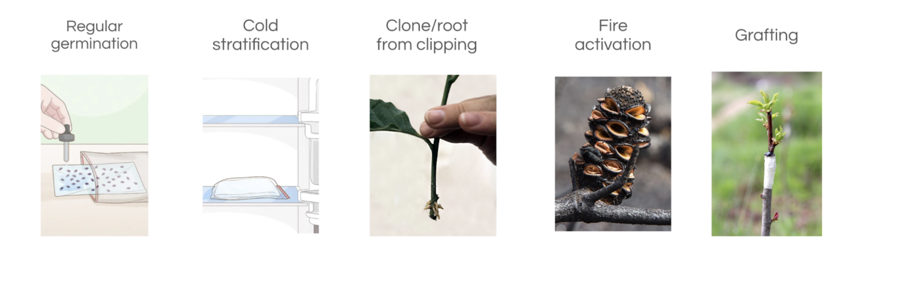

# Local Reforestation Guide 

This guide is designed to empower citizens to actively contribute to local reforestation efforts. It focuses on the propagation and planting of native species, leveraging Silvi’s Measurement, Reporting, and Verification (MRV) technology for tracking and reporting progress.

### Part 1: Understanding the Importance of Native Species 

Native species are crucial for maintaining local biodiversity and ecosystem balance. They are well-adapted to local conditions, making them more resilient and less dependent on human intervention once established. They also provide habitat for local wildlife and contribute to the health of the soil. There are 70,000 tree species globally and Silvi is in the early stages of building a library of species-specific methodologies to make reforestation practices more accessible and replicable 

### Part 2: Utilizing Silvi’s MRV Technology 

Silvi's MRV technology is an innovative tool that allows citizens to Monitor, Report and Verify (MRV) all types of tree-related insights or impact in their area. This decentralized system ensures the tracking of tree growth, health, and the success of reforestation efforts, providing valuable data for local and global environmental initiatives. 

[Explore Silvi App](https://app.silvi.earth/login) 

[Silvi App User Guide](./User%20Guide/)

### Part 3: Identifying and Registering Mother Trees

Identifying suitable mother trees is a crucial step in the reforestation process. A suitable mother tree should be healthy, mature, and capable of providing viable seeds or cuttings. Use Silvi to register these trees, ensuring the genetic diversity and local adaptability of future seedlings.

### Part 4: Propogation Techniques 

There are various techniques for propagating trees from seeds and cuttings. Propagation techniques vary widely and this is why a library of methodologies is important. In these early stages, Silvi is looking to collaborate with anyone interested to establish methodologies that can be validated to work. But in general there are a few techniques to propagation.

**Seed Propagation:** Collect seeds from the mother tree, fruit or credible seed provider. Clean them if necessary, and sow them in a seed bed, tray or directly into a pot filled with a suitable growing medium. Alternatively, germinate in a special purpose medium such as the tissue paper method before introducing the seedling to soil. Keep the medium moist. 

**Cuttings:** Take cuttings from the mother tree, preferably from younger branches. Remove the lower leaves, dip the cut end in rooting hormone if possible, and place it in a pot with a suitable growing medium or aerated water.. Keep the medium moist until roots develop.

**Grafting:** This technique involves joining a piece from one tree (the scion) to the stem of another tree (the rootstock). The joined parts grow together, forming a new tree.

### Part 5: Establishing Community Nurseries 

Community-led nurseries can raise seedlings from local seeds and cuttings. These nurseries can provide a constant supply of native seedlings for reforestation efforts. This not only helps establish sleeping supply from local genetics but also bypasses commercial supply chains and can help save money. 

### Part 6: Planting and Stewardship 

When the seedlings have grown strong enough, they can be planted out. The best practices include:

**Timing:** Plant trees during or just before the rainy season to ensure they have enough water to establish.

**Spacing:** Space trees appropriately to prevent competition for resources.

**Care:** Regularly water the young trees, protect them from pests, and monitor their growth.

### Part 7: Impact Evaluation through EBF

[The Ecological Benefit Framework (EBF)](https://ebfcommons.org/) is a tool for evaluating the impact and Silvi is planning on using it for reforestation efforts. Use Silvi’s MRV technology to collect data on reforestation, we can then quantify impact on air and water quality, soil health, carbon sequestration, biodiversity effects and other metrics. We will continue to build tools that can help report these results for analysis and contribute to the larger understanding of reforestation benefits.

### Part 8: Community Engagement 

Engage with the community by sharing success stories and the tangible benefits of local reforestation efforts. Offer workshops, seminars, and online resources to educate citizens about ongoing reforestation and environmental stewardship.

### Conclusion: 

By following this guide, you can play an active role in local reforestation efforts, support the propagation of native species, and contribute to global efforts to monitor and enhance the ecological benefits of reforestation. Remember, each tree planted is a step towards a healthier planet! 

